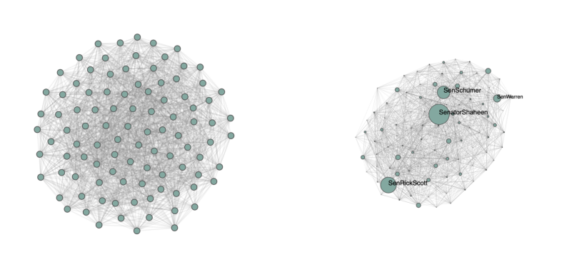
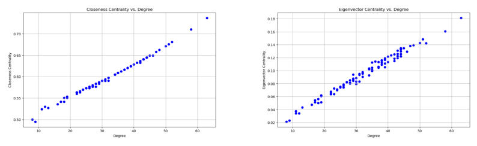
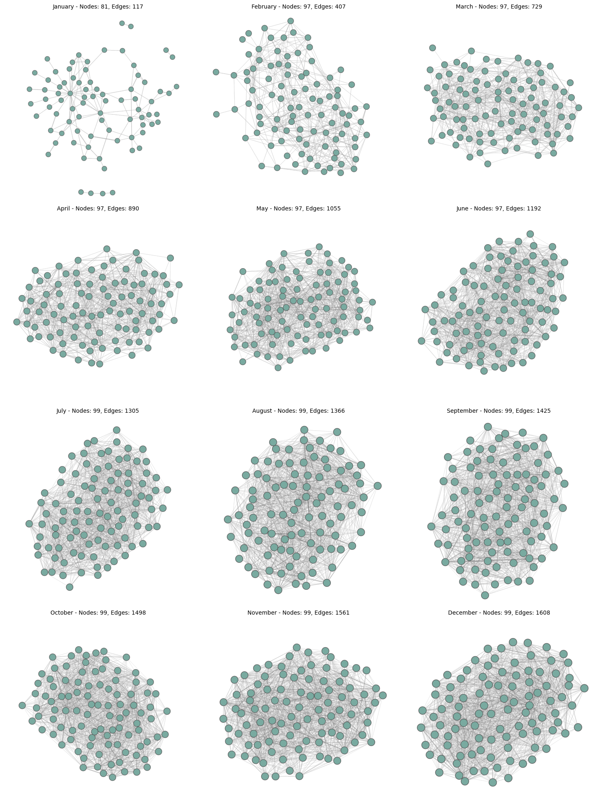

# Project Assignment B

## Dataset Overview and Scope of Project

The dataset selected for this project contains all the tweets made by US Senators during the first year of the Biden administration (2021) using their official twitter accounts. It is a ready-made dataset from Hugging Face which was created using the Twitter API in 2021. The dataset contains 5 variables namely the date the tweet was posted, a unique tweet id, the username of the senator that posted the tweet, the tweet text and the party (Democrat or Republican) that the senator is a part of. Furthermore, the dataset is 233 MB and contains 99,693 rows of data entries, where each row represents a tweet. This dataset was chosen as it allows for an exploration of the communities present within the US Senate, as well as all the topics and values discussed. The structure and nature of the dataset allows for the aforementioned exploration, as it provides a way to understand the social relationships between the US Senators through their social media interactions. The goal of this project is to answer the research question: **What topics did the members of the US Senate discuss on Twitter during the first year of the Biden administration, and what communities exist within the US senate based on Twitter data?**

## US Senate on Twitter Network

To better understand the complex system of the social interactions between US Senators on Twitter during the first year of the Biden administration, a network must be created. As there are 99 US Senators involved in the dataset, the network will contain 99 nodes each representing a US senator. In the dataset, there are 1608 unique tweets made by US senators soley addressing other US senators - hence, the network will contain 1608 edges, where each edge represents an interaction between senators. To examine whether the *US Senate on Twitter network* is a random network, a configuration model will be used to create a random network with the same number of nodes as the real network and with the same probability of there existing an edge between nodes. Given below in Figure 1. is a visualization of the real network compared to the random network. 

*Figure 1: A visualization of the US Senate on Twitter network compared to a random network with the same number of nodes and probability of forming an edge. The real network is on the right side and the random network is on the left side.*

Evidently in Figure 1. both networks have full connectedness, meaning that the largest connected component in both cases contains all 99 nodes. In addition, all nodes in the random network appears to have very same node degrees as indicated by the size of the nodes. Whereas for the real network modelled after real complex systems, there are more highly connected nodes (indicated by the large nodes heightened by the figure) and some nodes with a small node degrees, which the random network model fails to account for. Based on these qualitative observations, it becomes apparent that the real network of the US Senate on Twitter modelling the social iteractions between senators is far from random. This intuitively makes sense, as each tweet made by senators is part of a political plan to better their political stance. Therefore, behind each tweet and iteraction on Twitter is a hidden agenda and motive. It can also be seen that some senators choose to be actively involved on Twitter, whereas others choose to be more passive - indicated by the different node sizes. 

## Assortativity Analysis

Assortativity is a powerful network metric that can be used to evaluate the social iteractions between senators on Twitter. A network is said to be assortative in the context of this project if there is a clear tendency that senators who are Democrats mention other senators who are also Democrats, and likewise for Republicans. This is analogous to the social trend of popular people being friends with other popular people, and less popular people being friends with other less popular people. Given below in Figure 2. is a depiction of assortativity distributions by political party for 100 random networks compared to the real networks assortativity. 

*Figure 2: Distributions of assortativity coeffecients and assortativity by degree for 100 random networks created using the configuration model compare to the real network values*

Firstly, by looking at the plot on the left side it is clear to see that the real networks assortativity coeffecient is significantly greater that the assortativity coeffections of random networks modelled using the configuration model. This indicates that connections within the same party (either Democrat or Republican) are indeed significantly higher than chance. The large assortativity coeffecient indicates that there is a high likelihood that any two senators from the same party being connected by tweets mentioning one another. This is very interesting, as it shows that senators belonging to the same parties are highly likely to interaction on Twitter through tweets. This also aligns with the preconception that members of political parties tend to collaborate within their party more often than with members from other parties.  

By observing the plot on the right side, it is clear to see that the degree assortativity of the real network is not significantly different from the degree assortativity of random networks. This means that Senators who are very active on Twitter and therefore have high node degrees, are not necessarily more likely to connect with other high-degree senators. This intuitively makes sense, as tweets are typically in response to real world situations, and so different tweets serve different purposes. The social interactions therefore depend on the context of the tweet and of the role of each senator in the US senate as well as their distinct values. 

## Centrality Analysis 

When exploring the properties of a social network, it can be insightful to investigate the nodes that have the most influence. In the context of the *US Senators on Twitter network*, we can compute the closeness centrality to find the most central senators, where closeness centrality measures how close a given node is to all other nodes in the network. By calculating this metric for all nodes in the network, it was found that the five most central senators are *SenKevinCramer, SenatorShaheen, SenRonJohnson, SenatorDurbin,* and *SenSchumer*. It is therefore likely that these senators play a critical role in the political discussions taking place on twitter. Additionally, these senators likely connect with many others on twitter and tend to collaborate with others often. This indicates that they are influential and widely recognized on the social media platform.  

The eigenvector centrality also measures a node's closeness to other nodes in the network to quantify the importance of the node, and it reflects the idea that a node's importance is enhanced if it is linked to other nodes that are important themselves. By computing this metric for all nodes in the network, it was found that the same five senators that have the highest closeness centrality (as aforementioned) also have the highest eigenvector centrality in the network. This emphasizes how influential each of these senators are to the overall network and the discussions that took place.  

To gain deeper insight, Figure 3. visualizes the relationship between closeness centrality of nodes and their degrees, as well as the relationship between eigenvector centrality of nodes and their degrees for the network. By observing both plots, it is evident that both relationships are strongly linear, indicating that a node with a higher degree almost always has a high closeness centrality and eigenvector centrality. By interpreting this result, it can be concluded that the more senators a senator interacts with in the Twitter network, the more influential the senator is to the overall network. 

*Figure 3: A visualization of the closeness centrality and eigenvector centrality both as a function of node degree for the US senate twitter network. Note that both plots show very strong positive correlations*

## Wordclouds For Communities in US Senate on Twitter Network

Having explored the network deeply, we now find communities within it using the Louvain communities function.

## Evolution of US Senate twitter network over time

*Figure 5: A visualization of the evolution of the US Senate Twitter network over time. Note that the network quickly converges to a fully-connected network.*

