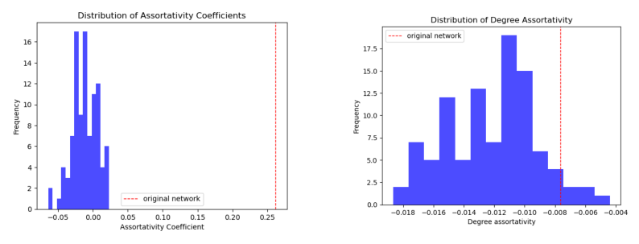

# Project Assignment B

## Dataset overview

The dataset selected for this project contains all the tweets made by US Senators during the first year of the Biden administration (2021) using their official twitter accounts. It is a ready-made dataset from Hugging Face which was created using the Twitter API in 2021. The dataset contains 5 variables namely date, id, username, text and party. Furthermore, the dataset is 233 MB and contains 99,693 rows of data entries. 

## US Senate on twitter network

*Figure 1: A visualization of the US Senate on Twitter network compared to a random network with the same number of nodes and probability of forming an edge*

## Assortativity analysis

*Figure 2: Distributions of assortativity coeffecients and assortativity by degree for 100 random networks created using the configuration model compare to the real network values*

## Centrality analysis 

*Figure 3: A visualization of the closeness centrality and eigenvector centrality both as a function of node degree for the US senate twitter network. Note that both plots show very strong positive correlations*

## Wordclouds for communities in US Senate on twitter network

## Evolution of US Senate twitter network over time

